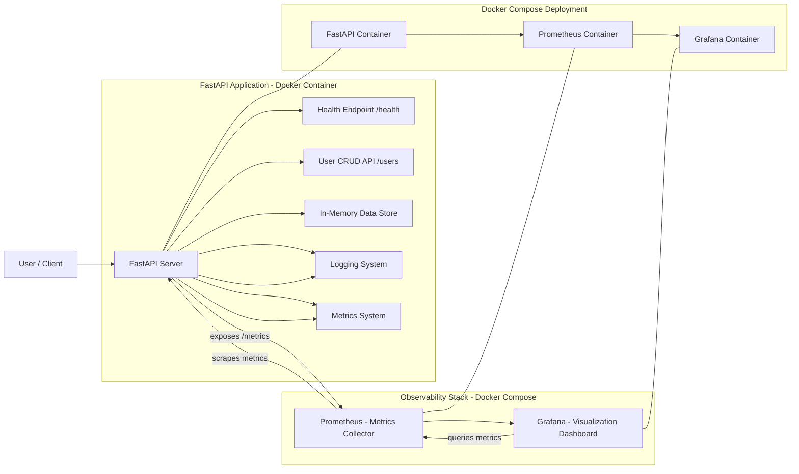

# Cloud API Monitoring System 🚀

For this project I used FastAPI, Prometheus, Grafana besides Docker Compose to build a system that monitors backends in a way that is typical for cloud environments. It shows how people develop application programming interfaces and record events in a structured format. With this setup the system collects metrics and allows users to observe how software performs. By using those tools, the project illustrates how to deploy applications within containers.

---

## 🧱 Tech Stack

* FastAPI — REST API backend
* Prometheus — Metrics collection and monitoring
* Grafana — Real-time dashboard visualization
* Docker & Docker Compose — Containerization and orchestration
* Python Logging — Structured application logs

---

## ✨ Features

* REST API with CRUD operations
* Structured logging system
* `/metrics` endpoint for Prometheus
* Real-time monitoring dashboards
* Request count tracking
* Error rate monitoring
* Response time / latency monitoring
* Dockerized multi-service deployment

---

## 📡 API Endpoints

| Endpoint      | Method | Description        |
| ------------- | ------ | ------------------ |
| `/health`     | GET    | Health check       |
| `/users`      | GET    | Retrieve users     |
| `/users`      | POST   | Create user        |
| `/users/{id}` | DELETE | Delete user        |
| `/metrics`    | GET    | Prometheus metrics |

---

## 🚀 Quick Start

Clone the repository:

```bash
git clone <your-repo-url>
cd <your-project-folder>
```

Run the full system:

```bash
docker compose up --build
```

---

## 📊 Monitoring Services

| Service     | URL                   |
| ----------- | --------------------- |
| FastAPI API | http://localhost:8000 |
| Prometheus  | http://localhost:9090 |
| Grafana     | http://localhost:3000 |

---

## 🏗️ System Architecture

```text
FastAPI API
     ↓
Structured Logging + Metrics
     ↓
Prometheus Monitoring
     ↓
Grafana Dashboard Visualization
```

---

## 📈 Grafana Dashboards

The Grafana dashboard includes:

* Requests per second
* Error rate monitoring
* API latency visualization
* Real-time metrics tracking

---

## 🎯 Learning Objectives

This project was built to practice:

* Backend API development
* Observability concepts
* Metrics monitoring
* Docker containerization
* Service orchestration
* Cloud engineering fundamentals

---

## 🏗️ Architecture


